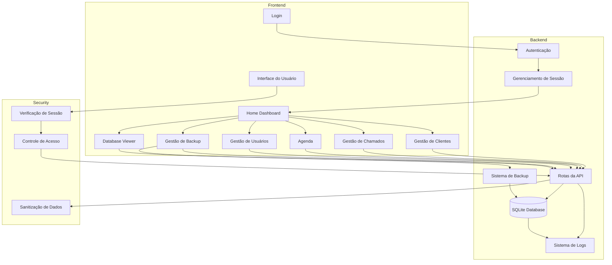

# HelpHub

## Principais mudanças desta versão

- **Frontend totalmente refeito e modularizado:**
  - Agora, HTML, CSS e JavaScript estão organizados em pastas separadas (`HTML/`, `CSS/`, `JS/`).
  - Cada funcionalidade tem seus próprios arquivos, facilitando manutenção e evolução.
  - Não há mais arquivos grandes e misturados (ex: CSS ou JS dentro do HTML).
  - O código está mais limpo, organizado e fácil de entender.

---

## Estrutura de Pastas

```
HelpHub/
│
├── HTML/         # Arquivos de interface (uma página HTML para cada tela)
├── CSS/          # Estilos separados por tela/função
├── JS/           # Scripts JavaScript separados por tela/função
├── IMAGENS/      # Imagens e ícones
├── DOCS/         # Documentação e instruções do sistema
├── DATABASE/     # Banco de dados SQLite
├── SERVER/       # Backend Flask (app.py, configs, scripts de inicialização)
├── LOGS/         # Arquivos de log do sistema
├── REQUERIMENTOS/# Arquivos de dependências (requirements.txt)
└── Release note.txt  # Notas de versão
```

## Diagrama Geral



---

## Como executar o sistema

### Linux via Gunicorn

```sh
cd HelpHub/SERVER
chmod +x start_server.sh
./start_server.sh
```

### Windows via Flask

```sh
cd HelpHub/SERVER
python app.py
```

(Necessário instalar as dependências do `requirements.txt`)

### Docker

```sh
cd HelpHub/SERVER
docker build -t helphub:latest .
docker run -d -p 5000:5000 --name helphub_container helphub:latest
```

---

## Observações

- Todas as telas do sistema agora estão em arquivos HTML separados na pasta `HTML/`.
- Cada tela tem seu próprio CSS e JS, facilitando manutenção e customização.
- O backend Flask serve as APIs e arquivos estáticos.
- Consulte a pasta `DOCS/` para instruções detalhadas de uso e configuração.

---
