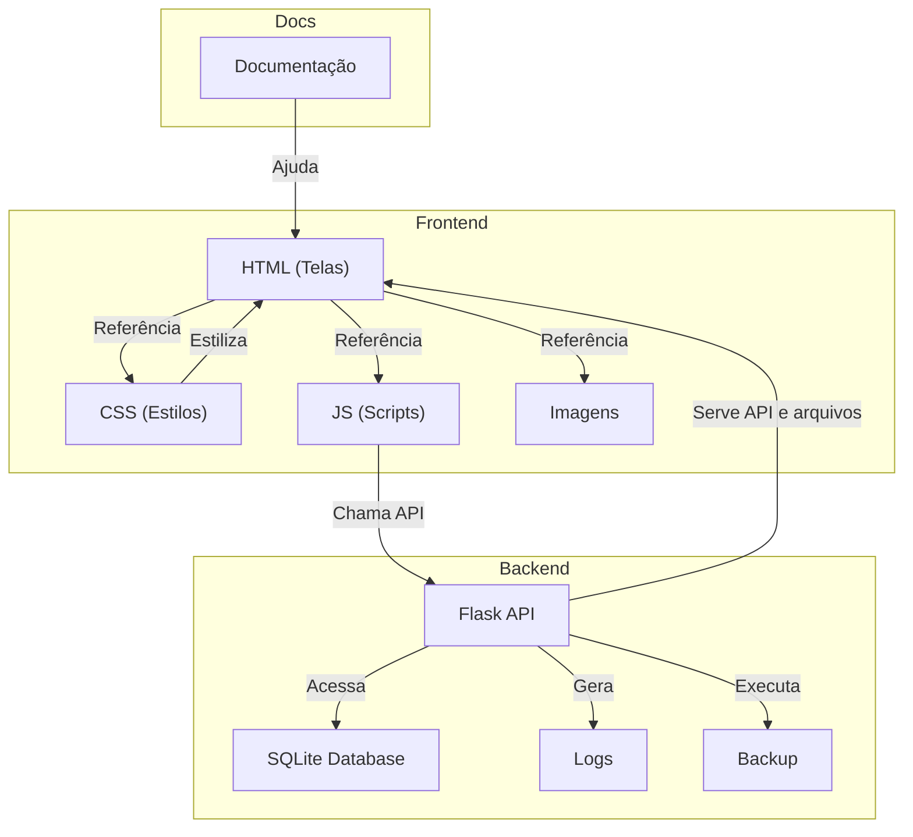

# HelpHub Legacy

> [!CAUTION]
> **PROJETO LEGADO:** Este repositório contém a versão antiga do sistema e será mantido apenas para histórico.
>
> **Por que mudar de repositório?**
> O HelpHub foi totalmente **reconstruído do zero**. A nova versão (v4.0) utiliza uma arquitetura completamente diferente, design moderno, segurança reforçada e performance otimizada, o que o torna um projeto novo e incompatível com a estrutura deste código antigo.
>
> O novo **HelpHub v4.0** está disponível em:
> 👉 **[github.com/DreamerJP/HelpHub](https://github.com/DreamerJP/HelpHub)**

---

## Estrutura de Pastas

```
HelpHub/
│
├── HTML/         # Arquivos de interface (uma página HTML para cada tela)
├── CSS/          # Estilos separados por tela/função
├── JS/           # Scripts JavaScript separados por tela/função
├── IMAGENS/      # Imagens e ícones
├── DOCS/         # Documentação e instruções do sistema
├── DATABASE/     # Banco de dados SQLite
├── SERVER/       # Backend Flask (app.py, configs, scripts de inicialização)
├── LOGS/         # Arquivos de log do sistema
├── REQUERIMENTOS/# Arquivos de dependências (requirements.txt)
└── Release note.txt  # Notas de versão
```

## Diagrama Geral



---

## Como executar o sistema

### Linux via Gunicorn

```sh
cd HelpHub/SERVER
chmod +x start_server.sh
./start_server.sh
```

### Windows via Flask

```sh
cd HelpHub/SERVER
python app.py
```

(Necessário instalar as dependências do `requirements.txt`)

---

## Observações

- Todas as telas do sistema agora estão em arquivos HTML separados na pasta `HTML/`.
- Cada tela tem seu próprio CSS e JS, facilitando manutenção e customização.
- O backend Flask serve as APIs e arquivos estáticos.
- Consulte a pasta `DOCS/` para instruções detalhadas de uso e configuração.

---
